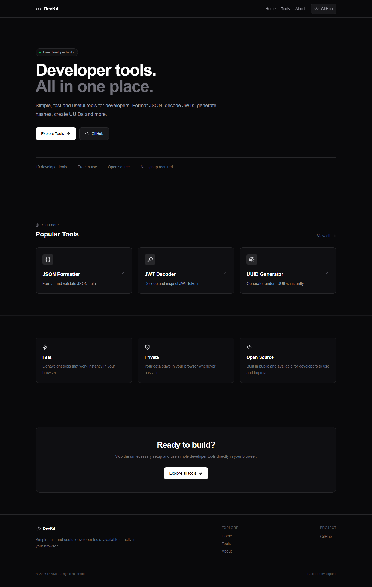

# DevKit

> Simple, fast and useful developer tools — all in one place.

DevKit is an open-source collection of browser-based tools built for developers.

Format JSON, decode JWTs, generate UUIDs, test regex, convert timestamps and more — without unnecessary setup or signup.

## 📸 Preview



## 🌐 Live Demo

https://devkit.pars-paris1.workers.dev/

## ✨ Features

- ⚡ Fast and lightweight
- 🔒 Privacy-focused browser tools
- 🧰 Multiple developer utilities
- 🔎 Search and filter tools
- 📱 Responsive design
- 🌐 No signup required
- 🧑‍💻 Open source

## 🛠️ Available Tools

| Tool | Description |
| --- | --- |
| JSON Formatter | Format and validate JSON data |
| JWT Decoder | Decode and inspect JWT tokens |
| UUID Generator | Generate random UUIDs |
| Regex Tester | Test regular expressions |
| Base64 Encoder | Encode and decode Base64 |
| Timestamp Converter | Convert Unix timestamps |
| Hash Generator | Generate secure hashes |
| URL Encoder / Decoder | Encode and decode URL components |
| Color Converter | Convert HEX, RGB and HSL colors |
| Password Generator | Generate strong random passwords |

## 🚀 Getting Started

### Requirements

- Node.js
- npm

### Installation

Clone the repository:

```bash
git clone https://github.com/parsarvs1/devkit.git

Enter the project:

cd devkit

Install dependencies:

npm install

Start the development server:

npm run dev

Open:

http://localhost:3000

---

🧱 Built With
Next.js
React
TypeScript
Tailwind CSS
Lucide React
📁 Project Structure
devkit/
├── app/
│   ├── about/
│   ├── tools/
│   └── page.tsx
│
├── components/
│   ├── Navbar.tsx
│   ├── Footer.tsx
│   └── ToolCard.tsx
│
├── data/
│   └── tools.ts
│
├── public/
│   └── screenshots/
│       └── devkit-home.png
│
├── package.json
└── README.md
🤝 Contributing

Contributions are welcome.

If you have an idea for a useful developer tool:

Fork the repository
Create a new branch
Make your changes
Test the project
Open a Pull Request

Please read CONTRIBUTING.md before contributing.

📄 License

This project is open source and available under the MIT License.

⭐ Support

If you find DevKit useful, consider giving the repository a star on GitHub.

It helps the project grow and reach more developers.

Built for developers.