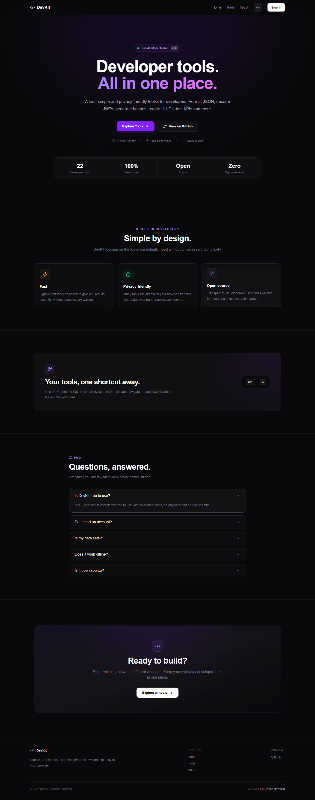

<div align="center">

# 🧰 DevKit

**Simple, fast and useful developer tools — all in one place.**

Format JSON, decode JWTs, generate UUIDs, test regex, convert timestamps and more —
right in your browser, with no signup.

[**Live Demo**](https://devkit.pars-paris1.workers.dev/) · [Report a Bug](https://github.com/parsarvs1/devkit/issues) · [Request a Tool](https://github.com/parsarvs1/devkit/issues)


</div>

---

## 📸 Preview



## ✨ Features

- ⚡ **Fast and lightweight** — results appear instantly
- 🔒 **Privacy-focused** — many tools run entirely in your browser
- 🧰 **22 developer utilities** in one place
- 🔎 **Search and filter** tools quickly
- ⌨️ **Command Palette** — press `Ctrl + K` to jump to any tool
- 📱 **Responsive design** — works on desktop and mobile
- 🌐 **No signup required**
- 🧑‍💻 **Open source** (MIT)

## 🛠️ Available Tools

DevKit ships with **22 tools**, all listed in [`data/tools.ts`](data/tools.ts):

| Tool                        | Description                                              |
| --------------------------- | -------------------------------------------------------- |
| JSON Formatter              | Format and beautify JSON data instantly                  |
| JWT Decoder                 | Decode JWT tokens and inspect their contents             |
| UUID Generator              | Generate random UUIDs quickly                            |
| Regex Tester                | Test and debug regular expressions                       |
| Base64 Encoder              | Encode and decode Base64 strings                         |
| Timestamp                   | Convert and work with Unix timestamps                    |
| Color Converter             | Convert colors between HEX, RGB and HSL                  |
| Hash Generator              | Generate hashes from text and data                       |
| Hash Compare                | Compare two hash values and check whether they match     |
| URL Encoder / Decoder       | Encode and decode URL components                         |
| Password Generator          | Generate strong random passwords securely in your browser |
| Password Strength Analyzer  | Analyze password strength and security requirements      |
| Markdown Previewer          | Write and preview Markdown in real time                  |
| Markdown Playground         | Edit and experiment with Markdown interactively          |
| JSON → TypeScript           | Convert JSON into TypeScript interfaces                  |
| JSON → Zod                  | Convert JSON into Zod validation schemas                 |
| Color Palette Generator     | Generate a full color scale from a base color            |
| API Tester                  | Test HTTP APIs and inspect responses                     |
| HTTP Request Builder        | Build and send HTTP requests directly from your browser  |
| Environment Variable Generator | Generate and format environment variables             |
| Snippets                    | Save and manage reusable code snippets                   |
| Tool Chaining               | Connect multiple DevKit tools into one workflow          |

Browse the full list on the [Tools page](https://devkit.pars-paris1.workers.dev/tools).

## 🚀 Getting Started

### Requirements

- [Node.js](https://nodejs.org/) (LTS recommended)
- npm

### Installation

```bash
# Clone the repository
git clone https://github.com/parsarvs1/devkit.git

# Enter the project
cd devkit

# Install dependencies
npm install

# Start the development server
npm run dev
```

Then open [http://localhost:3000](http://localhost:3000).

## 🧱 Built With

- [Next.js](https://nextjs.org/) (App Router)
- [React](https://react.dev/)
- [TypeScript](https://www.typescriptlang.org/)
- [Tailwind CSS](https://tailwindcss.com/)
- [Lucide React](https://lucide.dev/)
- [NextAuth.js](https://authjs.dev/)
- [Cloudflare Workers](https://workers.cloudflare.com/) (via [OpenNext](https://opennext.js.org/))
- [Tauri](https://tauri.app/) + [Vite](https://vitejs.dev/) for the desktop shell in [`desktop/`](desktop) and [`src-tauri/`](src-tauri)

## 📁 Project Structure

```
devkit/
├── app/                    # Next.js App Router
│   ├── about/
│   ├── account/
│   ├── api/                # Auth and data API routes
│   ├── dashboard/
│   ├── login/
│   ├── quick-actions/
│   ├── settings/
│   ├── signup/
│   ├── tools/              # One folder per tool + the tools listing
│   ├── workspace/
│   ├── layout.tsx
│   └── page.tsx            # Landing page
├── components/             # Navbar, Footer, ToolCard, CommandPalette, widgets…
├── data/
│   └── tools.ts            # Single source of truth for the tool list
├── hooks/                  # usePinnedTools, useRecentTools
├── lib/                    # toolMetadata, db, pins, toolHistory, shareState…
├── shared/                 # Framework-agnostic tool logic (hash, jwt, base64…)
├── desktop/                # Tauri + Vite desktop shell
├── src-tauri/              # Tauri config and native wrapper
├── public/
│   └── screenshots/
│       └── devkit-new-home.png
├── auth.ts                 # NextAuth configuration
├── open-next.config.ts     # OpenNext (Cloudflare Workers) config
├── wrangler.jsonc          # Cloudflare Workers config
├── next.config.ts
├── package.json
└── README.md
```

> Tool logic lives in `shared/` so it can be reused by both the web app and the desktop shell.

## ➕ Adding a New Tool

1. Create a new route under `app/tools/<tool-slug>/` with a `page.tsx` (the UI) and a `layout.tsx` that calls `toolMetadata("<tool-slug>")` for SEO metadata.
2. Put the framework-agnostic logic in `shared/` so the desktop app can reuse it.
3. Register the tool in [`data/tools.ts`](data/tools.ts) — add its `name`, `description`, `icon`, `href` and `category`. This makes it show up on the tools page, in search and in the command palette.
4. Test it locally with `npm run dev`, and run `npm run lint` before submitting.
5. Open a Pull Request.

## 🤝 Contributing

Contributions are welcome! If you have an idea for a useful developer tool:

1. Fork the repository
2. Create a new branch (`git checkout -b feature/my-tool`)
3. Make your changes
4. Test the project
5. Open a Pull Request

Please read [CONTRIBUTING.md](CONTRIBUTING.md) before contributing.

## 🗺️ Roadmap

DevKit is pre-1.0, aiming for 50+ tools. The full plan lives in [ROADMAP.md](ROADMAP.md). Highlights:

- [ ] More tools (diff checker, cron parser, SQL formatter, YAML/CSV converters…)
- [ ] Per-tool documentation, examples and FAQs
- [ ] Accessibility — target WCAG 2.2 AA
- [ ] Performance — Lighthouse 95+ across the board
- [ ] Custom domain
- [ ] PWA / offline support — a web app manifest is already in place; a service worker is next

## 📄 License

Released under the [MIT License](LICENSE).

## ⭐ Support

If you find DevKit useful, please consider giving the repository a star — it helps the project reach more developers.

<div align="center">

**Built for developers.**

</div>
